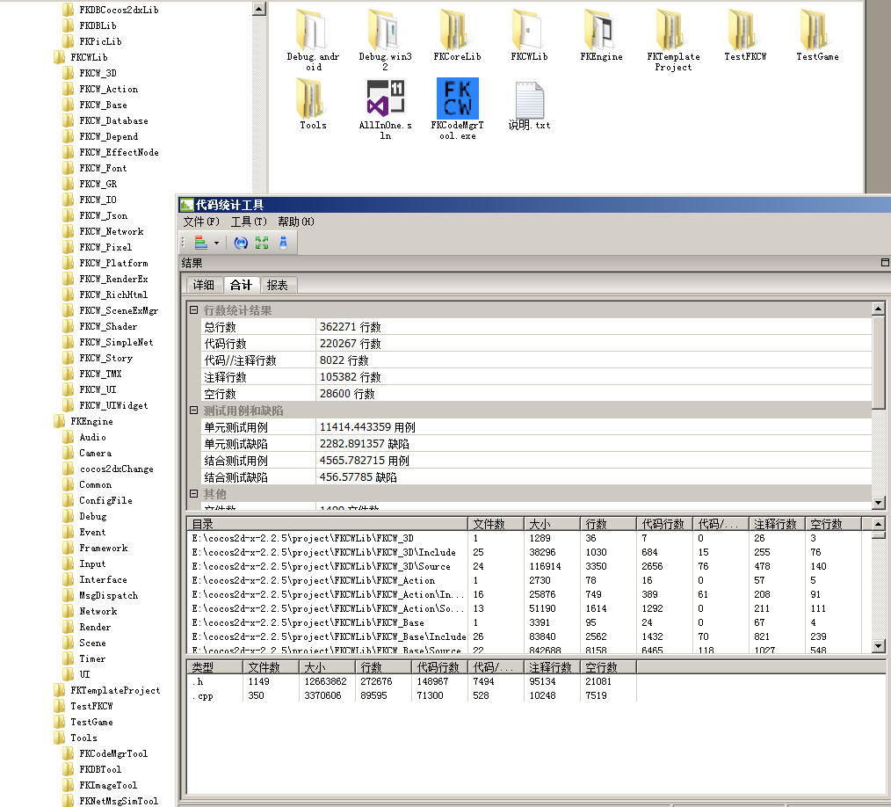

# FKCocos2dxWrapper_2.x
It's a good improved function warpper for Cocos2dx 2.x version.Incude GestureRecognizer, Data, Freetype fonts creater, 3D, Net(UDP,TCP,HTTP), new UI system and widgets, A* path finder, decodes,new actions, lots of shaders, and new render effects, TMX(tiled) maps and so on.It also has tools and examples code. 

